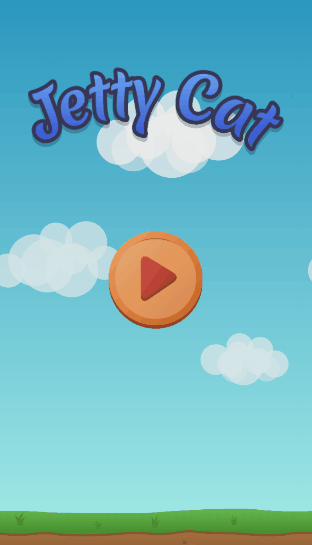
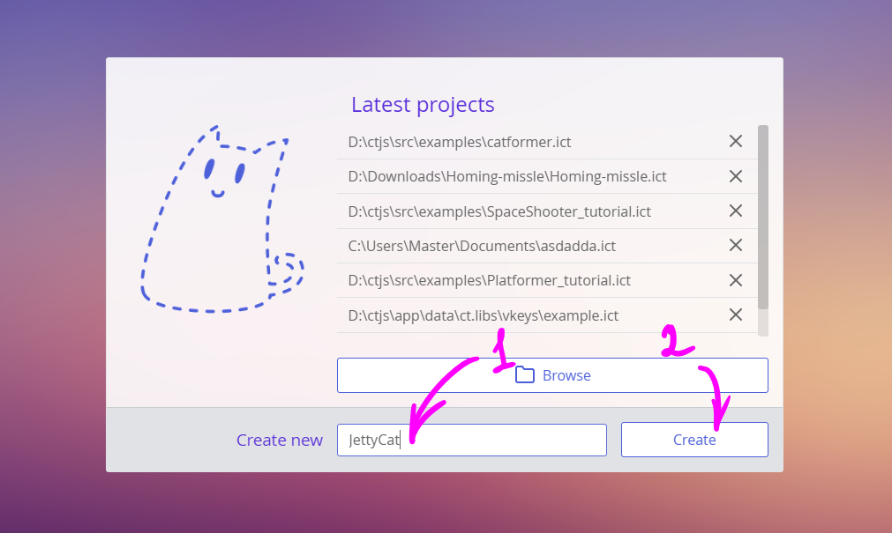
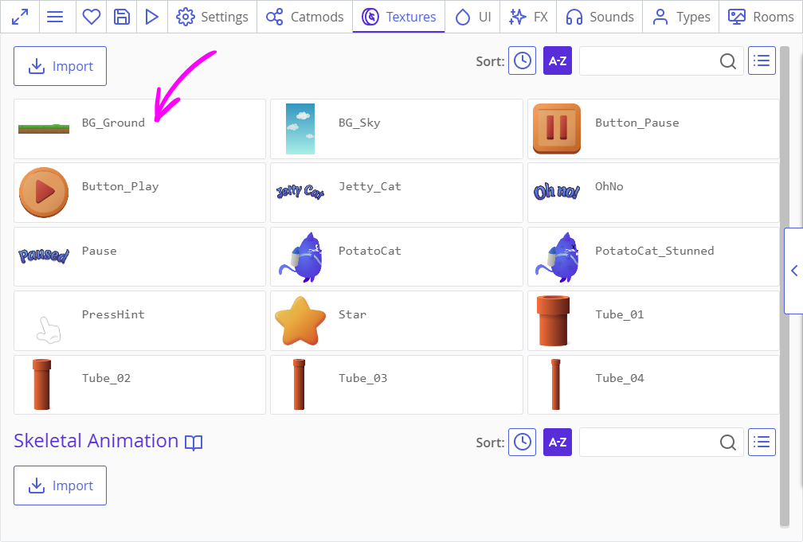
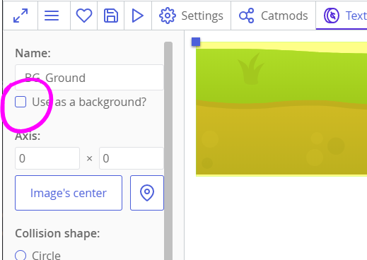

# Making Games: Jetty Cat

Similar to Flappy Bird, Jetty Cat will be a game where a cat, manipulated by tapping or clicking, avoids infinite obstacles by using its jetpack. We will firstly implement main game logic, then — UI. After that, we will polish the game by adding nice transitions, particle systems and subtle effects.



That's what we will do:

[[toc]]

## Creating the project and importing assets

Open ct.js and create a new project by writing the name of your project and clicking the "Create" button. Tell ct.js where to save your project. A folder like "My Documents" would be a good choice.



Click the "Textures" tab at the top of ct.js' window. Then, open your default file viewing app (aka file explorer), and find the folder `examples/JettyCat_assets` inside ct.js' folder. Inside, there are the assets we will use. Drag the assets from your file viewer to ct.js, and ct will quickly import them to the project.

We will need to prepare these textures: properly mark backgrounds as such, and set collision shapes so that copies inside your game precisely interact with each other. Firstly, let's open the backgrounds for our project. Click the `BG_Ground` card:



Here, we will need to click the checkbox "Use as a background?" This tells ct.js to pack this texture differently and allows to repeat it in our levels.



Hit "Save" at the bottom left corner. Now, do the same with `BG_Sky` texture.

Backgrounds are ready! Time to set collision shapes of our sprites. We don't need to set them everywhere, but we do need to set them for objects that collide with each other, and for those that we click at while in a game. Headers like `Jetty_Cat`, `OhNo` and `Pause` won't be interactive and will be just decorations, as well as `PressHint` will have an informing role and won't directly receive clicks as well. But the cat and tubes will collide, and stars need to know when a cat overlaps them.

Let's open the `PotatoCat`! The first thing we should do is move the axis of the texture. It is shown as a square axis, which is at the top left corner by default. An axis is the point around which a copy is scaled and rotated. Put the axis at the center of the cat's body. Then, let's define its collision shape. The cat doesn't look like a circle or a rectangle, so set its collision shape as a polygon in the left column. A pentagon will appear: you can drag its corners and add new points by clicking on yellow lines to better outline cat's silhouette. 15 points is enough to outline it.


::: tip
It would be a good idea not to outline the tail, as well as ears. When a tail hits a tube and a player loses, they may think that it is unfair. In any way, a tail is too flexible to cause lethal collisions 😺
:::

After defining the shape, click the "Save" button to return to the list of assets. We will need to tune the texture `PotatoCat_Stunned` in the same way, as well as `Star`.

For pipes, we will use something *a bit* different. Open the first one, `Tube_01`, and place its axis nearly at the bottom at the sprite. Remember that axis affects not only rotation, but also scaling? As we will reuse the same texture for pipes that hang from the top of the screen, it would be logical to attach their root to the top of the screen, and flip the end with a hole down. We can even rotate them later, and they will nicely wave with their base rooted in place.


We will need to do it for all the four tube textures. Then, we can start creating our level and coding movement!

## Creating our main room and moving the cat

Let's create the room where all the fun will be happening! Rooms are often called as levels. These are the places where all your resources get combined, and where they can interact with each other. Open the "Rooms" tab at the top of ct.js window, and create a new one.

TODO: image

A room editor for this exact room will appear. Call the room as `InGame` — we will use this particular name later in code. There is no rules in naming them, though; we just need something we can remember later while coding menus :)

TODO: image

Then we need to set the size of our room. Set it to 1080x1920 pixels.

Now, let's add our backgrounds. Click the tab "Backgrounds", then add two of them: for the sky and for ground. The sky looks good as is, but the ground needs tweaking. Click the cog next to background's texture in the left column, and find the drop-down "Repeat". Set it to "repeat-x": it will make the background tile horizontally only, as X is the horizontal axis (Y is the vertical one). Then, we will need to shift the ground right to the bottom of the room's frame by changing Shift Y field.

TODO: image

::: tip Hint:
You can navigate the room by dragging it with mouse and zooming with mouse wheel, or with "zoom" buttons in the left-right corner.
:::

We will also set the depth of both backgrounds so that they are aligned properly. A depth is a 3rd dimension that tells ct.js how to sort our objects, so that sky doesn't accidentally overlap everything else. Positive values bring stuff closer to camera, and thus objects with positive depth will overlap those with a negative one.

Set sky's depth value to -20, and ground's depth to -10. That's how ct.js will understand these configs:


TODO: image

### Cat's type

Textures are essential to most games, but they don't do anything on their own. We used *backgrounds* already, and they are for purely decorative textures. *Types*, on the other hand, can include gameplay logic and are used to create *copies*. Copies are the things we add to our rooms, and these copies are the entities that interact with each other on the screen.

Let's create a type for our cat! Open the "Types" tab at the top of ct.js window, and press the "Create" button. Name it as `PotatoCat`, and set its texture by clicking the "Change sprite" square and selecting cat's texture.

TODO: image

We can now add the cat to our room! Navigate to it by switching back to the "Rooms" tab and opening our only room. Our cat will appear in the left column under the "Copies" tab. Click on it, and then click once again in place where you want your copy appear in the level. We will need just one cat for now.

If you click the "Play button" now, it will run the debugger, and we will see a static screen with our backgrounds and our cat. The cat doesn't move yet, and that's what we will change now!

TODO: image that shows how to run the project
TODO: image of a static room

Open the "Types" tab again, and open the cat's type. Here we have four tabs for code:

* "On Create" which code runs once when a copy is created;
* "On Step" that runs at each frame;
* "Draw" that runs at the end of each frame after other computations and movement updates;
* "On Destroy" that runs once a copy is removed.

That's what we will do:

* We will set our cat flying to the right by defining its speed and direction in the On Create tab;
* We will also check for mouse and touch events at each frame in the On Step event, and will accelerate the cat so that it can fly up.

In the On Create tab, put this code:

``` js
this.speed = 10;
this.direction = 0;
```

`this.speed = 10;` means that we need to move the cat by 10 pixels at each frame. With 60 FPS per second, it will be 600 pixels in a second — about a half of our room.

`this.direction = 0;` means that we move the cat in a given direction at 0 degrees. 0 degrees mean that it will move to the right, 90 — to the top, 180 — to the left, and 270 — downwards.

Now, let's move our cat whenever a player presses the screen. We will need to support both mouse and mobile touch events, and will need to enable a module that provides support for these. It's easy, though: open the "Catmods" tab at the top of the ct.js window, and find the module `touch` in the left column. Click it, and smash that big button to enable it:

TODO:

There is an option in the `touch` module that will help our code stay cleaner. Open the settings tab of the module, and tick the option "Detect mouse events as touch events". With this option, we can write code for touch events only, and it will automatically work for mouse as well.

Now, in ct.js, input methods are grouped into *Actions*. In this project, we will use just one input method — touching the screen. Open the "Settings" tab at the top of the screen, and find the button "Edit actions".

TODO: screenshot

Add our first action, name it `Poof`. Yea. Then, click "Add an input method" on the right, and find "Any touch" method under the Touch heading. You can use the search to quickly filter out the results.

The action is done, we can save it and move back to our cat.

::: tip Actions? Why?
Actions are great when you need to support a number of different input methods. Say, you create a game that supports both keyboard and gamepad, and the keyboard supports WASD movement and moving with arrows. One action will support all the three methods, and your code will stay slim, even if you add new input methods later. Besides that, they all can be used with the same code!

You can [read more about actions here](actions.html).
:::

Add this code to cat's On Step event:

```js
if (ct.actions.Poof.down) {
    this.gravity = 2;
    this.addSpeed(ct.delta * 4, 90);
}
```

`if (ct.actions.Poof.down)` work only when a player presses the screen. If it works, we will define a gravity force that pulls the cat down and add speed that pulls the cat upwards. We need to multiply the added speed with `ct.delta` to make it run smoothly on every occasion.

::: tip ct.delta
`ct.delta` will be equal to 1 most of the time, but this multiplier should not be overlooked. If a player's framerate drops, or the game lags for some reason, `ct.delta` will become a larger value to compensate these frame drops and lags. For example, if framerate drops from 60 frames per second to 30, then `ct.delta` will temporarily be equal to 2.

Besides that, `ct.delta` supports in-game time stretching and allows for creating slow-mo effects and game pauses. (And we will implement these features!)
:::

::: tip
There are also `ct.actions.Poof.pressed` and `ct.actions.Poof.released` that return `true` when a player starts and stops pressing the screen.
:::

The gravity that is defined in the On Step seems strange, right? It is indeed a constant that would be better placed in the On Create event, so that it is set once from the beginnning and doesn't change. But placing it inside the clause with an input check adds a little trick: the cat will start falling only after the player interacts with the game! Thus they won't instantly lose as the cat would quickly hit the ground otherwise.

Now, make sure that you have the default line `this.move();` in your On Step tab. This line is responsible for re-calculating copy's position. It should be the last line in your On Step code.

TODO: a screenshot of the resulting code

If we run the project now, we will see that the cat moves from left to right, and then reacts to clicks and starts flying and falling. It quckly flies out of the viewport though. Set's change it!

### Moving the camera

Ct.js has an entity `ct.camera` which is responsible for showing stuff on your screen. It has lots of features, and one of them is following a copy.

Open the tab "On Create" of our cat, and add this code:

```js
ct.camera.follow = this;
ct.camera.followY = false;
ct.camera.shiftX = 250;
```

`ct.camera.follow` links to a copy it should follow, and we tell it to follow the cat by setting it to `this`. `this` refers to the copy that runs the code. Rooms have their events and `this` keyword, too.

`ct.camera.followY = false;` tells that we don't need to move the camera vertically (by Y axis). We will only slide it to the right.

`ct.camera.shiftX = 250;` tells that we want the camera to stay 250 pixels to the right relative to the cat. By default, it focuses so that the cat stays in the center of the viewport.

## Writing code for collisions

It's a good time to implement actual gameplay. We will add a type for tubes, place some of them in the level, and code collisions both for pipes and ground. Then, we will randomize pipe's textures, thus changing their height.

### Adding pipes

Create a new type and call it `Tube`. Select its texture as one of the relatively long pipes in our collection. Then, set its collision shape to "Obstacle".

TODO: screenshot

Then, open our room and add pipes on the ground, so we can check the collisions. Open the room `InGame`, select the tube in the left column, and then add them by clicking in the level view where you want to spawn them.

TODO: screenshot

Then, open the cat's type, and select its On Step tab. We will do the following:

* We will check for a collision between a cat and some obstacle.
* If we hit a tube, we will throw cat to the right, change its texture, and set a flag that we've lost.
* This flag will be checked at the very beginning of the code and will prevent player's input and other logic if needed.

That's the code that checks for collisions:

```js
// If the cat bumped into something solid and the game is not over
if (!this.gameover && ct.place.occupied(this, 'Obstacle')) {
    // Change the texture
    this.tex = 'PotatoCat_Stunned';
    // Set a flag that we will use to stop other logic
    this.gameover = true;
    // Jump to the left
    this.speed = 25;
    this.direction = 135;
    // Stop camera movement
    ct.camera.follow = false;
}
```

`ct.place.occupied` checks for a collision of a given copy with a specific collision group. This method is provided by `ct.place` module, and you can find its reference for other methods in the "Catmods" tab.

We will also need this block of code right at the beginning of On Step event:

```js
if (this.gameover) {
    this.gravity = 2;
    this.move();
    return;
}
```

`this.gravity = 2;` will make sure that there is a gravity set to the cat even if the player hasn't interacted with a game yet (in the case when they lose by no interaction). `return;` stops further execution, and we place `this.move()` above that, because the same line at the bottom won't be executed.

TODO: a screenshot of the current state of code

Time for some testing!

### Making the cat lose if it touches ground or screen's top edge

For some reason, the floor — and even the sky — is as deadly as tubes in flappy bird-like games. Now, ground does not have a type and won't work with `ct.place`, as well as sky, as it is not a game's entity at all. But they are flat, horizontal, and we can augment our collision logic with rules that check cat's position in space.

If we now open our room and move the mouse over the level, we will see current coordinates in the bottom left corner. The top side of the initial view frame is always at 0 pixels on the Y axis, and the ground's top edge is somewhere at 1750 pixels. Copies' position is defined by `this.x` and `this.y`, and we can read them and compare to some other values.

Modify the collision logic as following so the cat gets stunned from hitting the ground an sky as well. Note that we added parenthesis around new comparisons and `ct.place.occupied` to divide them

```js {3,4,5,6}
// If the game is not over, the cat bumped into something solid, or
if (!this.gameover && (ct.place.occupied(this, 'Obstacle') ||
    // the cat is below the ground minus its approximate height, or
    this.y > 1750 - 200) ||
    // the cat flew off the upper boundary,
    this.y < 0
) {
    // Change the texture
    this.tex = 'PotatoCat_Stunned';
    // Set a flag that we will use to stop other logic
    this.gameover = true;
    // Jump to the left
    this.speed = 25;
    this.direction = 135;
    // Stop camera movement
    ct.camera.follow = false;
}
```


### Randomizing pipe's height by changing its texture

We changed the cat's texture in the code above with `this.tex = 'NewTextureName';`.

…

## Spawning pipes through time

## Adding stars

### Spawning stars

### Creating a UI element with a counter

## Creating menus

### Main menu

### Pause menu

### Score screen

## Polishing the game

### Transition between rooms

### Cat's jet smoke and star particles

### Adding subtle animations to the cat and stars

### Adding a hint to start tapping

### Smoothly resuming the game after it has been paused

### Adding sounds

### Animating background in the main menu + parallax effect

## That's it!

Try changing this stuff to train yourself in coding:

* Change the cat's movement so that it is more close to what happens in Flappy Bird: make the cat fly upwards abruptly when a player taps the screen, but do nothing if they then press the screen continuously.
* Make rotating tubes to make the game more challenging.
* Add a life counter, and allow a player to take 3 hits before loosing.