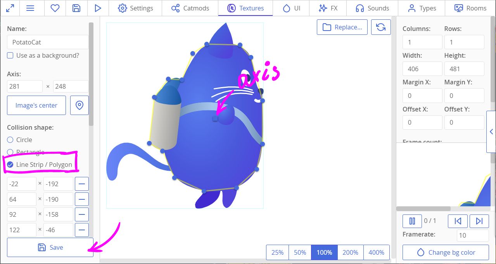
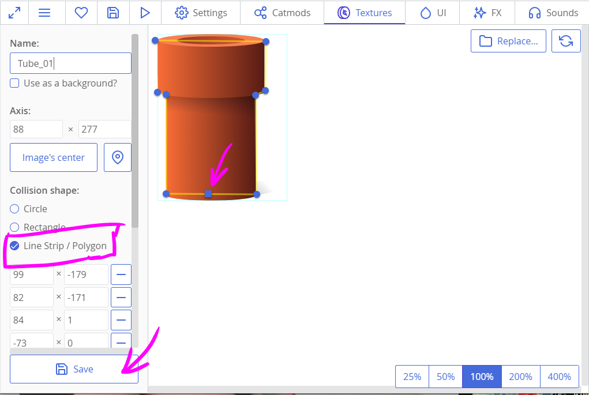

# Making Games: Jetty Cat

Similar to Flappy Bird, Jetty Cat will be a game where a cat, manipulated by tapping or clicking, avoids infinite obstacles by using its jetpack. We will firstly implement main game logic, then — UI. After that, we will polish the game by adding nice transitions, particle systems and subtle effects.

That's what we will do:

[[toc]]

## Creating the project and importing assets

Open ct.js and create a new project by writing the name of your project and clicking the "Create" button. Tell ct.js where to save your project. A folder like "My Documents" would be a good choice.

Click the "Textures" tab at the top of ct.js' window. Then, open your default file viewing app (aka file explorer), and find the folder `examples/JettyCat_assets` inside ct.js' folder. Inside, there are the assets we will use. Drag the assets from your file viewer to ct.js, and ct will quickly import them to the project.

We will need to prepare these textures: properly mark backgrounds as such, and set collision shapes so that copies inside your game precisely interact with each other. Firstly, let's open the backgrounds for our project. Click the `BG_Ground` card:

Here, we will need to click the checkbox "Use as a background?" This tells ct.js to pack this texture differently and allows to repeat it in our levels.

Hit "Save" at the bottom left corner. Now, do the same with `BG_Sky` texture.

Backgrounds are ready! Time to set collision shapes of our sprites. We don't need to set them everywhere, but we do need to set them for objects that collide with each other, and for those that we click at while in a game. Headers like `Jetty_Cat`, `OhNo` and `Pause` won't be interactive and will be just decorations, as well as `PressHint` will have an informing role and won't directly receive clicks as well. But the cat and tubes will collide, and stars need to know when a cat overlaps them.

Let's open the `PotatoCat`! The first thing we should do is move the axis of the texture. It is shown as a square axis, which is at the top left corner by default. An axis is the point around which a copy is scaled and rotated. Put the axis at the center of the cat's body. Then, let's define its collision shape. The cat doesn't look like a circle or a rectangle, so set its collision shape as a polygon in the left column. A pentagon will appear: you can drag its corners and add new points by clicking on yellow lines to better outline cat's silhouette. 15 points is enough to outline it.

::: tip
It would be a good idea not to outline the tail, as well as ears. When a tail hits a tube and a player loses, they may think that it is unfair. In any way, a tail is too flexible to cause lethal collisions 😺
:::

After defining the shape, click the "Save" button to return to the list of assets. We will need to tune the texture `PotatoCat_Stunned` in the same way, as well as `Star`.

For pipes, we will use something *a bit* different. Open the first one, `Tube_01`, and place its axis nearly at the bottom at the sprite. Remember that axis affects not only rotation, but also scaling? As we will reuse the same texture for pipes that hang from the top of the screen, it would be logical to attach their root to the top of the screen, and flip the end with a hole down. We can even rotate them later, and they will nicely wave with their base rooted in place.

We will need to do it for all the four tube textures. Then, we can start creating our level and coding movement!

## Creating our main room and moving the cat

Let's create the room where all the fun will be happening! Rooms are often called as levels. These are the places where all your resources get combined, and where they can interact with each other. Open the "Rooms" tab at the top of ct.js window, and create a new one. Call it `InGame` — we will use this particular name later in code. There is no rules in naming them, though; we just need something we can remember later while coding menus :)

Then we need to set the size of our room.

Now, let's add our backgrounds. Click the tab "Backgrounds"

### Backgrounds

### Cat's type

Textures are essential to most games, but they don't do anything on their own.

### Moving the camera

## Writing code for collisions

### Adding pipes

### Making the cat lose if it touches ground or screen's top edge

## Spawning pipes through time

## Adding stars

### Spawning stars

### Creating a UI element with a counter

## Creating menus

### Main menu

### Pause menu

### Score screen

## Adding a hint to start tapping

## Polishing the game

### Transition between rooms

### Cat's jet smoke

### Adding subtle animations to the cat and stars

### Smoothly resuming the game after it has been paused

### Adding sounds

### Animating background in the main menu + parallax effect

## That's it!